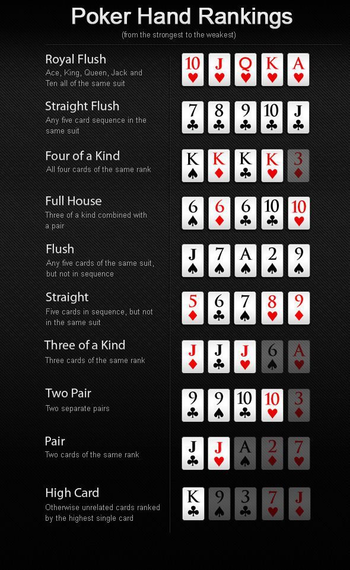

    <b>
        <h1 align="center">Poker Hand Detection</h1>
    </b>

    

    

#### **Thank you for visiting 🙏 I hope you find this project useful**  

#### **📃 License**
[MIT][license] © [Hasanain][website]

[license]: https://github.com/Hassi34/poker-hand-detection/blob/main/LICENSE
[website]: https://hasanain.aicaliber.com

Let's connect on **[``LinkedIn``](https://www.linkedin.com/in/hasanain-mehmood)**  